# Django-Project
A mini project created in a 24hr Hackaton using Django
1. My Login Page
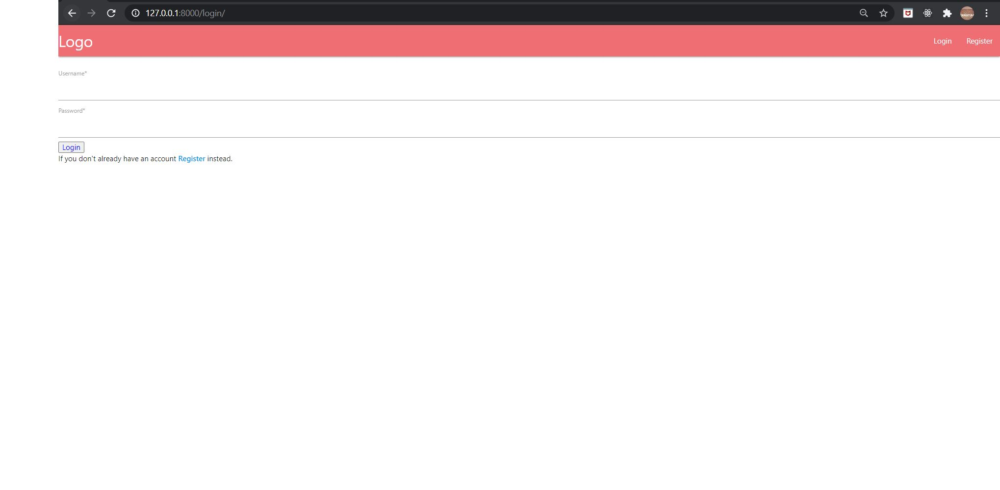
2. My Registration Page
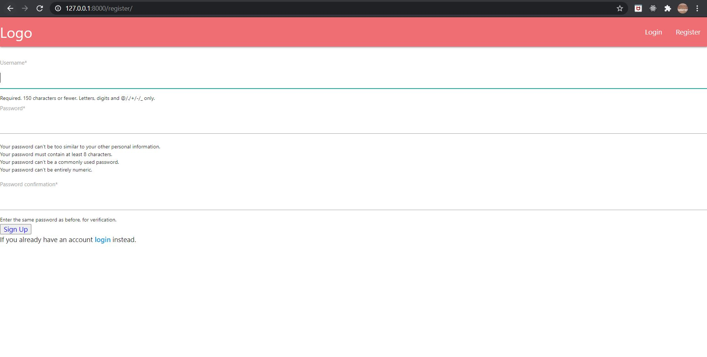
3. All questions in the forum
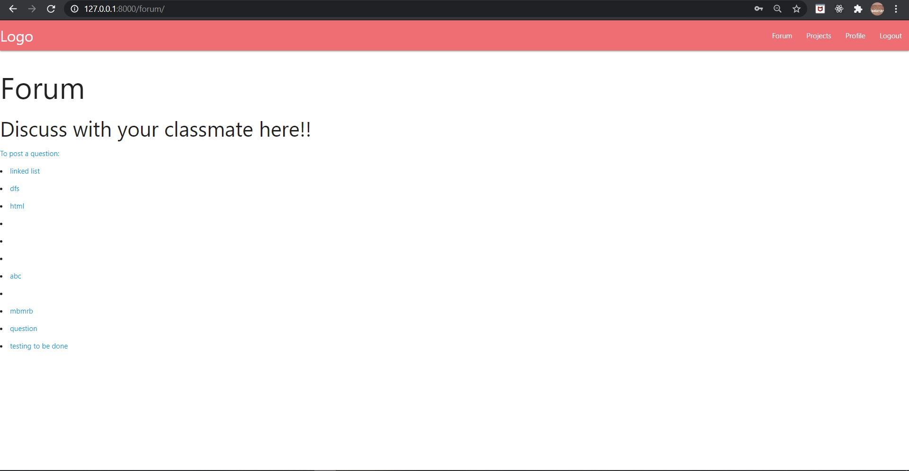
4. Each question has different answers provided by peers
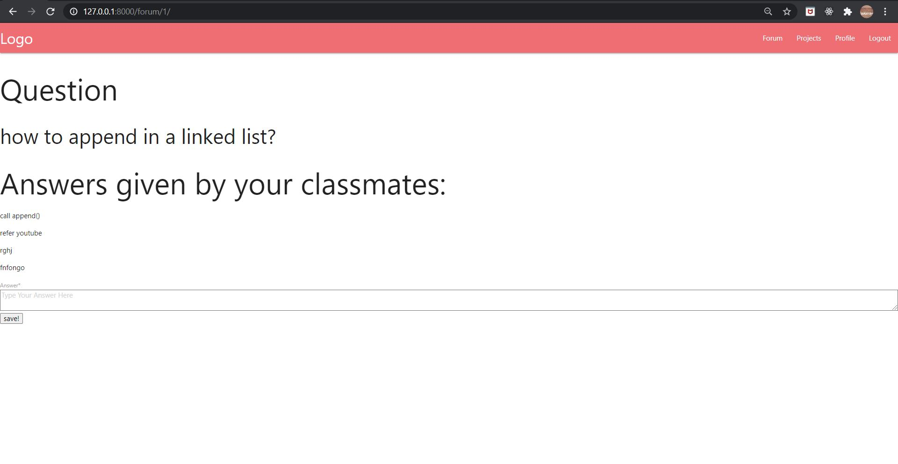
5. Have a doubt? Ask here !
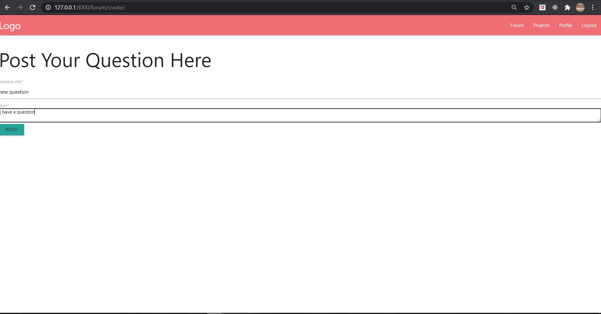
6. View all projects uploaded by your peers.
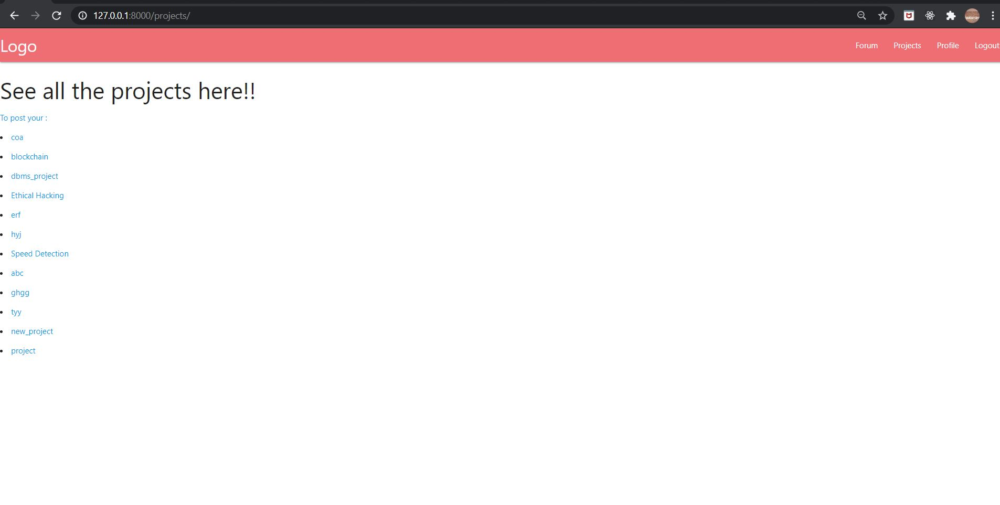
7. Study the project in detail and comment on it.
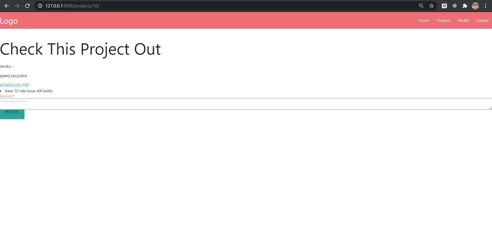
8. Upload your project here!
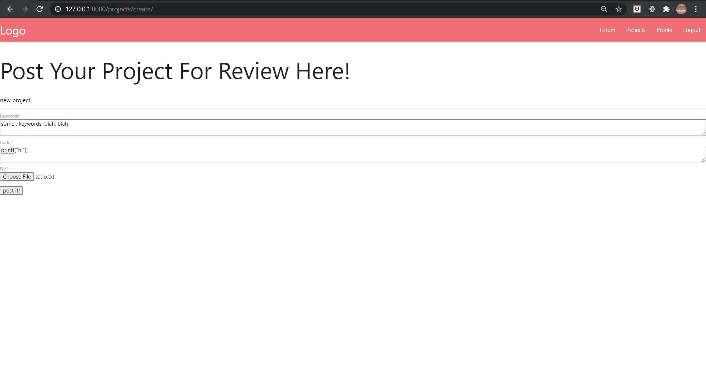
9. View all student profiles here!
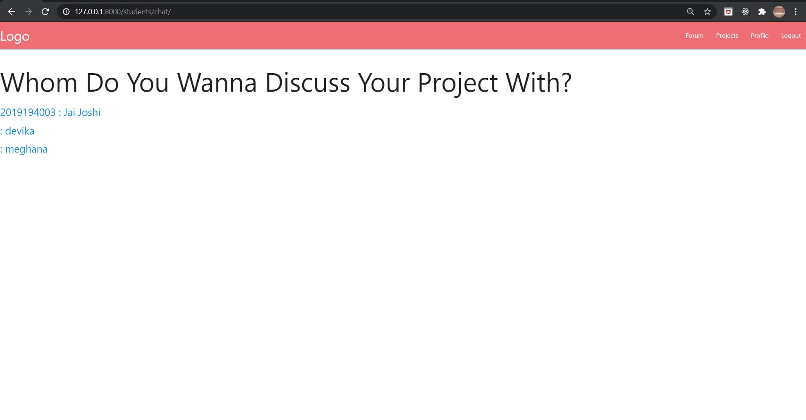
10. View your profle here!
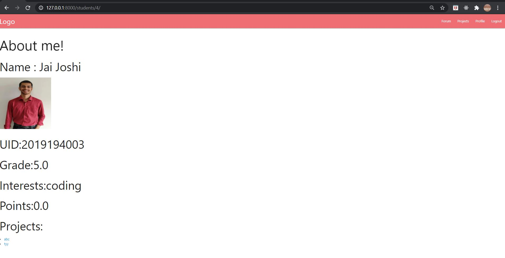
11. Checkout the admin interface which the teachers and staff will have access to!
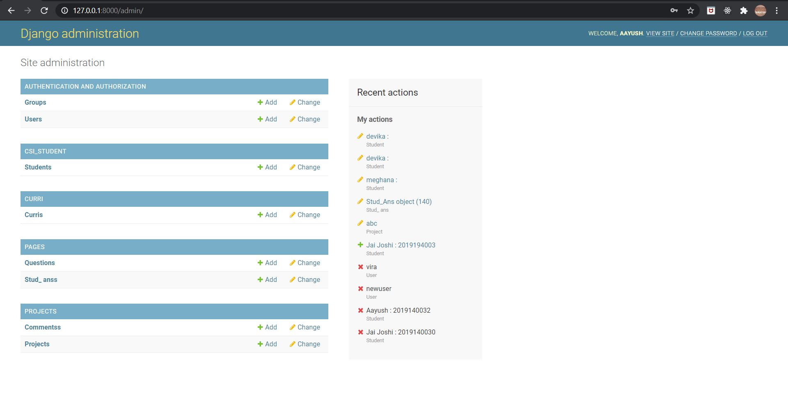
